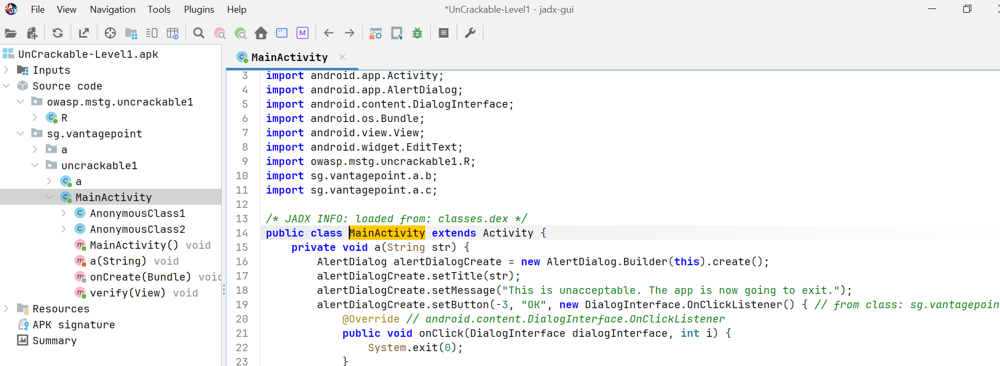
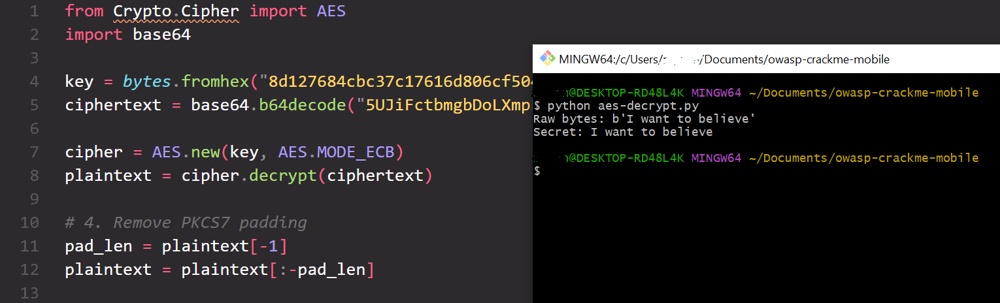
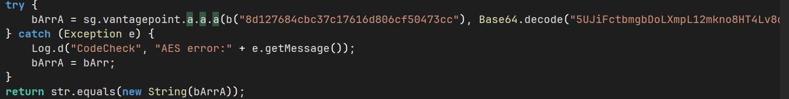
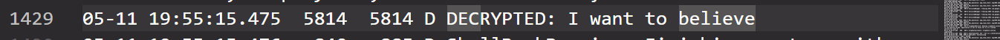

# OWASP UnCrackable Level 1

## Objective
Simple Android application that displays a text input field and a submit button. The goal is to determine the correct input string that triggers a success dialog.

## Approach
Decompile the target APK and find out where the input string is being compared to the real string.
 
## Static Analysis
- Found that the uncrackable string was encrypted using AES encryption.
- I used a python script to decrypt the cipher text given the symmetric key.
- Found that the uncrackable text was “I want to believe”

## Binary Patching
- Decoded the uncrackable APK that resulted in a directory containing smali code.
- Modified smali code to obtain byte array containing decrypted text and stored in string to log.
- Rebuilt APK using apktool. Signed the APK using apksigner.
- Uninstalled crackme application from Android emulator.
- Used the adb or Android Debug Bridge to install the built APK to the Android emulator device.
- Executed the logcat command to view logging implemented from the smali code.
- The correct input string was logged once the submit button handler was triggered.

## Screenshots

## Key Takeaways
I learned that using a decompiler tool like JADX is useful to scope out potential points of interest to solve crackmes. Also, there are many ways to solve a crackme with methods such as binary patching.
