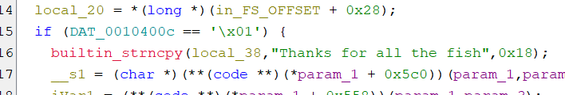
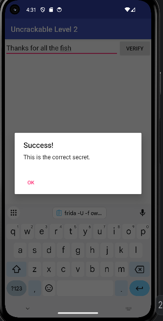

# OWASP UnCrackable Level 2

## Objective
Android application that displays a text input field and a submit button. The goal is to determine the correct input string that triggers a success dialog.

## Approach
Open the application and analyze behavior when running on Android emulator.
 
## Static Analysis
- The application was exiting upon startup. At first I thought it was crashing because of possible missing libraries. Ran logcat while starting up the application and a tombstone report. Ran a command to view the crash log buffer.
- Inspected code using JADX and found that a native library was being loaded through a static initializer. I was thinking that the JNI code could have to do with the application crashing. To validate my suspicions I opened the shared object file named "libfoo.so" in Ghidra. Searched through the function names and found two native functions. Immediately found that one of the functions was using a strncmp with the hardcoded value "Thanks for all the fish". I knew this string would trigger a success for the application logic.      
- The application was still crashing upon starting up so I had to solve this before I could enter the correct password. The crash was caused by an intentional anti-debugging routine implemented in native code using fork and ptrace, which terminates execution in non-standard runtime environments such as emulators. This is a common pattern used by malware authors to prevent analysis of the malware program.
- Now that I found what the issue was for the application crashing, I wrote a Frida hook to bypass the init() method in MainActivity(located in scripts folder). The application was no longer crashing when running the Frida script.
- Entering the correct password seemed to be failing when clicking the verify button on the GUI. There was a value being set in the JNI code we bypassed that was being used in the other JNI method. The other JNI method used this value in a conditional to check the input value vs hardcoded correct value. I wrote logic in the existing Frida script to bypass the check method.    

## Screenshots

## Key Takeaways
- I reverse engineered an Android crackme that used both Java and native (JNI) code. I identified that the app’s native layer contained a hardcoded string, "Thanks for all the fish", which was compared against user input using strncmp. I also analyzed anti-debugging logic in native code using fork() and ptrace(), which was responsible for crashing or blocking analysis. Using Frida, I learned how to hook Java methods at runtime and bypass both initialization and validation logic by overriding their implementations. Overall, practiced end-to-end reverse engineering by combining static analysis (JADX/Ghidra) with dynamic instrumentation to understand and control program behavior.
